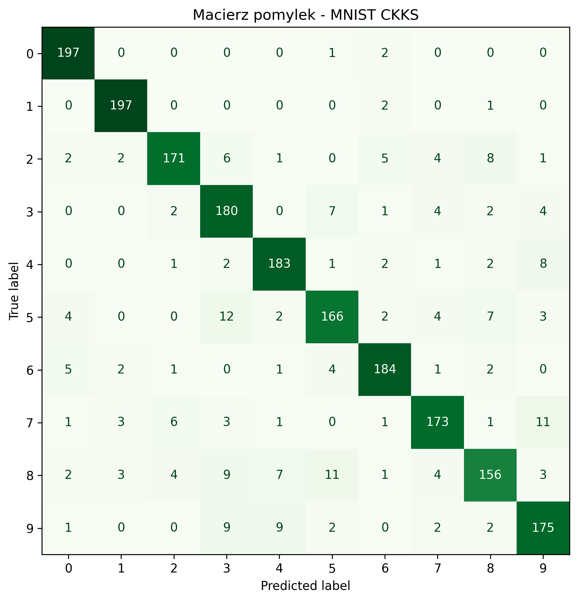

# Sprawozdanie z projektu: klasyfikacja homomorficzna

## Autorzy
Jakub Karczewski, Piotr Sielchanowicz, Michał Kowalczyk
## 1. Cel projektu

Celem projektu było sprawdzenie, czy można wykonać etap predykcji modelu klasyfikacyjnego na danych zaszyfrowanych homomoeficznie przy pomocy schematu szyfrowania CKKS.

Główna idea działania:

1. Trenowany jest klasyczny model liniowy na danych jawnych.
2. Próbka testowa jest szyfrowana jako wektor CKKS.
3. Model wykonuje homomorficznie obliczenie score'u klasy:

   ```text
   score = w * x + b
   ```

4. Wyniki score pozostają zaszyfrowane.
5. Po odszyfrowaniu wyników wybierana jest klasa z najwyższym score'em.

## 2. Wykorzystane narzędzia

W projekcie użyto:

- Python,
- TenSEAL,
- NumPy,
- scikit-learn,
- Matplotlib,
- Seaborn,
- multiprocessing dla przyspieszenia testu MNIST.

Schemat szyfrowania:

| Parametr | Wartość |
| --- | ---: |
| Schemat | CKKS |
| `poly_modulus_degree` | 8192 |
| `coeff_mod_bit_sizes` | `[60, 40, 40, 60]` |
| `global_scale` | `2**40` |

CKKS jest schematem przybliżonym, dlatego wyniki po odszyfrowaniu mogą minimalnie różnić się od wyników liczonych bez szyfrowania.

## 3. Eksperyment 1: klasyfikacja binarna Iris

Pierwszy eksperyment dotyczył binarnej klasyfikacji zbioru Iris. Użyto dwóch klas oraz czterech cech. Model regresji logistycznej został wytrenowany na danych jawnych, a następnie pojedyncza próbka testowa została zaszyfrowana i sklasyfikowana homomorficznie.


## 4. Eksperyment 2: klasyfikacja wieloklasowa Iris

Drugi eksperyment rozszerzył podejście na pełny zbiór Iris z trzema klasami. Dla każdej klasy obliczany był osobny score:

```text
score_i = w_i * x + b_i
```

Po odszyfrowaniu wyników wybierano klasę z największą wartością score. Dla przykładowej próbki notebook zwrócił:

| Klasa | Score po odszyfrowaniu |
| --- | ---: |
| 0 | -3.0578 |
| 1 | 2.3249 |
| 2 | 0.7329 |

Predykcja:

| Element | Wartość |
| --- | ---: |
| Przewidziana klasa | 1 |
| Prawdziwa klasa | 1 |

Metryki klasyfikacji homomorficznej dla całego testu Iris:

| Metryka | Wartość |
| --- | ---: |
| Accuracy | 1.0000 |
| Precision weighted | 1.0000 |
| F1 weighted | 1.0000 |

Powodem tego rezultatu było najpewniej to, że zbiór nie jest zbyt skomplikowany do klasyfikacji, bo klasy są łatwo separowalne.

## 5. Eksperyment 3: klasyfikacja MNIST

Charakterystyka danych:

| Cecha | Wartość |
| --- | ---: |
| Liczba próbek | 70000 |
| Liczba cech | 784 |
| Zbiór treningowy | 60000 |
| Zbiór testowy | 10000 |
| Liczba klas | 10 |

Model jawny został wytrenowany za pomocą `SGDClassifier` z funkcją straty `log_loss`.

### 5.1. Wyniki modelu jawnego na pełnym teście MNIST

| Metryka | Wartość |
| --- | ---: |
| Accuracy | 0.9155 |
| Precision weighted | 0.9156 |
| Recall weighted | 0.9155 |
| F1 weighted | 0.9152 |

Czas treningu modelu jawnego wyniósł `3.71 s`.

### 5.2. Podzbiór do testu homomorficznego

Ze względu na koszt obliczeń homomorficznych test CKKS wykonano na zbalansowanym podzbiorze testowym MNIST:

| Parametr | Wartość |
| --- | ---: |
| Liczba klas | 10 |
| Liczba próbek na klasę | 200 |
| Łączna liczba próbek | 2000 |

Dla każdej próbki szyfrowano wektor 784 pikseli, liczono score'y klas, odszyfrowywano wyniki i wybierano klasę przez `argmax`.

### 5.3. Wyniki klasyfikacji homomorficznej MNIST

| Metryka | Wartość |
| --- | ---: |
| Accuracy | 0.8910 |
| Precision weighted | 0.8913 |
| Recall weighted | 0.8910 |
| F1 weighted | 0.8904 |

Czas wykonania(głównie deszyfrowania) przyspieszony przy pomocy multiprocessingu:

| Miara | Wartość |
| --- | ---: |
| Liczba procesów | 4 |
| Całkowity czas klasyfikacji homomorficznej | 210.06 s |
| Średni czas na próbkę | 0.1050 s |

Macierz pomyłek dla MNIST CKKS:



## 6. Porównanie modelu jawnego i homomorficznego na tym samym podzbiorze

Porównanie nie odnosi się do pełnego testu MNIST, tylko dokładnie do tych samych 2000 próbek, które zostałe poddane deszyfrowaniu.

Metryki modelu jawnego na podzbiorze:

| Metryka | Wartość |
| --- | ---: |
| Accuracy | 0.8910 |
| Precision weighted | 0.8913 |
| Recall weighted | 0.8910 |
| F1 weighted | 0.8904 |

Porównanie predykcji:

| Miara | Wartość |
| --- | ---: |
| Zgodność predykcji jawnych i zaszyfrowanych | 1.0000 |
| Liczba różnych predykcji | 0 |

Oznacza to, że dla wybranego podzbioru 2000 próbek predykcje po obliczeniach CKKS były identyczne z predykcjami modelu jawnego. Nie oznacza to jednak, że model osiąga 100% skuteczności względem etykiet prawdziwych. Skuteczność względem etykiet wynosi `0.8910`, a zgodność `1.0000` dotyczy tylko porównania dwóch trybów inferencji: jawnego i homomorficznego.

## 7. Wnioski

1. Szyfrowanie homomorficzne CKKS pozwala wykonać liniową część predykcji bez odszyfrowywania danych wejściowych.
2. Dla modeli liniowych, takich jak regresja logistyczna lub liniowy klasyfikator SGD, obliczenie `w * x + b` dobrze pasuje do operacji wspieranych przez CKKS.
3. Na zbiorze Iris klasyfikacja homomorficzna dała poprawne wyniki i pełną skuteczność na testowanym zbiorze.
4. Na podzbiorze MNIST predykcje homomorficzne były zgodne z predykcjami modelu jawnego w 100% przypadków.
5. Błędy numeryczne CKKS były bardzo małe i nie zmieniły decyzji klasyfikatora w badanym teście.
6. Głównym ograniczeniem jest koszt obliczeniowy. Klasyfikacja 2000 próbek MNIST z użyciem 4 procesów trwała `210.06 s`.

## 8. Podsumowanie

Projekt potwierdza, że można wykonać inferencję prostego klasyfikatora liniowego na danych zaszyfrowanych. Dla testowanego podzbioru MNIST wyniki CKKS po odszyfrowaniu były identyczne z predykcjami modelu jawnego, a błąd numeryczny był pomijalny z punktu widzenia decyzji klasyfikacyjnej. Jednocześnie rozwiązanie jest znacznie wolniejsze (ze względu na złożoność obliczeniową deszyfrowania) niż klasyczna predykcja na danych jawnych, dlatego w praktyce wymaga ograniczania liczby próbek, równoleglenia obliczeń lub dalszej optymalizacji.
